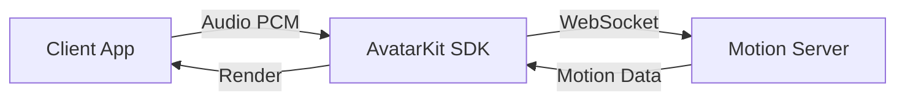

# Direct Mode

[](https://www.npmjs.com/package/@spatius/avatarkit)

## When to use Direct Mode

Direct Mode is for scenarios where **the client drives the avatar directly** — your app sends audio data to Spatius Motion Server, which returns motion data for lip-synced avatar rendering. The entire conversation pipeline (ASR, LLM, TTS) is your responsibility to implement wherever you prefer (client-side, your own backend, or a third-party service).

**Choose Direct Mode when:**
- You want full control over the conversation pipeline
- You already have your own ASR/LLM/TTS infrastructure
- You want to integrate AvatarKit into an existing app

**Choose [Backend Mode](../backend-mode/) when:**
- You want a turnkey server-side pipeline (backend handles ASR → LLM → TTS → Avatar)
- You want to keep API keys and AI logic on the server
- You need to support thin clients that only render

## Architecture



## Prerequisites

- [Spatius credentials](https://app.spatius.ai/apps) (App ID + Session Token)

## Quick Start

### Web quickstart

```bash
cd clients/web/speech-to-avatar-quickstart
pnpm install
pnpm dev
```

Open `http://localhost:3000`, enter your App ID, Avatar ID, and Session Token, then stream the bundled PCM audio to see the avatar speak.

Multi-framework Web reference clients live under `clients/web/reference/`: `react/`, `vue/`, `vanilla/`, `nextjs-direct/`, and `nextjs-iframe/`.

### Android

Open `clients/android/` in Android Studio. Enter App ID and Session Token on the config screen, select a character, and tap an audio file.

### iOS

```bash
cd clients/ios
xcodegen generate
```

Open `AvatarDemo.xcodeproj` in Xcode. Enter App ID and Session Token, select a character, and tap an audio file.

## Project Structure

```text
direct-mode/
├── clients/
│   ├── web/
│   │   ├── speech-to-avatar-quickstart/
│   │   └── reference/
│   │       ├── react/
│   │       ├── vue/
│   │       ├── vanilla/
│   │       ├── nextjs-direct/
│   │       └── nextjs-iframe/
│   ├── android/          # Kotlin + Compose
│   ├── ios/              # SwiftUI
│   └── flutter/          # Flutter (iOS + Android)
├── servers/              # Optional local session-token servers
│   ├── python/
│   ├── nodejs/
│   └── go/
└── README.md
```

## Extending with Real-Time Conversation

These demos use pre-recorded audio files to drive the avatar. To build a full voice conversation, replace the audio source with your own AI pipeline:

```typescript
// Instead of loading a PCM file:
const pcm = await yourTTS.synthesize(text)
controller.send(pcm.buffer, true)
```

## References

- [AvatarKit Direct Mode Guide](https://docs.spatius.ai/direct-mode/overview)
- [Get API Keys](https://app.spatius.ai/apps)
- [Test Avatars](https://app.spatius.ai/avatars/library)
- [Session Token Guide](https://docs.spatius.ai/api-reference/auth)
