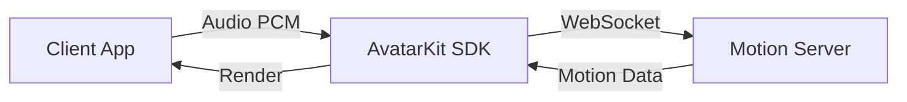

# Direct Mode

[](https://www.npmjs.com/package/@spatius/avatarkit)

## When to use Direct Mode

Direct Mode is for scenarios where **the client drives the avatar directly** — your app sends audio data to Spatius Motion Server, which returns motion data for lip-synced avatar rendering. The entire conversation pipeline (ASR, LLM, TTS) is your responsibility to implement wherever you prefer (client-side, your own backend, or a third-party service).

**Choose Direct Mode when:**
- You want full control over the conversation pipeline
- You already have your own ASR/LLM/TTS infrastructure
- You want to integrate AvatarKit into an existing app

**Choose [Backend Mode](../backend-mode/) when:**
- You want a turnkey server-side pipeline (backend handles ASR → LLM → TTS → Avatar)
- You want to keep API keys and AI logic on the server
- You need to support thin clients that only render

## Architecture


```mermaid
flowchart LR
    A["Client App"] -->|Audio PCM| B["AvatarKit SDK"]
    B -->|WebSocket| C["Motion Server"]
    C -->|Motion Data| B
    B -->|Render| A
```

## Prerequisites

- [Spatius credentials](https://app.spatius.ai/apps) (App ID + Session Token)

## Token servers

Direct Mode clients connect to Motion Server directly, but they must not hold `SPATIUS_API_KEY`. Use a small backend endpoint to exchange your server-side API Key for a short-lived Session Token, then pass that Session Token to the client.

The examples in `servers/python`, `servers/nodejs`, and `servers/go` are token servers only. They do not run ASR, LLM, or TTS; they do not connect to Motion Server; and they do not transport audio or motion data. For that runtime-server architecture, use [Backend Mode](../backend-mode/).

## Quick Start

### Web quickstart

```bash
cd clients/web/quickstart
pnpm install
pnpm dev
```

Open `http://localhost:3000`, fill `.env` with App ID, Avatar ID, and Session Token, then use **Sample audio** to stream the bundled PCM file and see the avatar speak.

The same quickstart also includes an optional **Realtime conversation** mode. Fill one provider section in `.env`, restart the dev server, select **Realtime conversation**, and the demo captures microphone audio, sends it to the selected realtime provider, and streams the assistant PCM output into AvatarKit.

This quickstart includes OpenAI Realtime and Gemini Live WebSocket adapters. Other realtime providers, such as Azure OpenAI Realtime, can be used by adapting their live audio output into PCM16 chunks.

Multi-framework Web reference clients live under `clients/web/reference/`: `react/`, `vue/`, `vanilla/`, `nextjs-direct/`, and `nextjs-iframe/`.

### Android

Open `clients/android/` in Android Studio. Enter App ID and Session Token on the config screen, select a character, and tap an audio file.

### iOS

```bash
cd clients/ios
xcodegen generate
```

Open `AvatarDemo.xcodeproj` in Xcode. Enter App ID and Session Token, select a character, and tap an audio file.

## Project Structure

```text
direct-mode/
├── clients/
│   ├── web/
│   │   ├── quickstart/
│   │   └── reference/
│   │       ├── react/
│   │       ├── vue/
│   │       ├── vanilla/
│   │       ├── nextjs-direct/
│   │       └── nextjs-iframe/
│   ├── android/          # Kotlin + Compose
│   ├── ios/              # SwiftUI
│   └── flutter/          # Flutter (iOS + Android)
├── servers/              # Optional local session-token servers
│   ├── python/
│   ├── nodejs/
│   └── go/
└── README.md
```

## Extending with Real-Time Conversation

The [`clients/web/quickstart`](./clients/web/quickstart) demo shows the smallest browser-only version: microphone PCM goes to a realtime model, assistant PCM comes back, and AvatarKit sends that audio to Motion Server for lip sync.

For production, keep long-lived realtime provider keys on your backend and mint short-lived browser tokens.

## References

- [AvatarKit Direct Mode Guide](https://docs.spatius.ai/direct-mode/overview)
- [Get API Keys](https://app.spatius.ai/apps)
- [Test Avatars](https://app.spatius.ai/avatars/library)
- [Session Token Guide](https://docs.spatius.ai/api-reference/auth)
