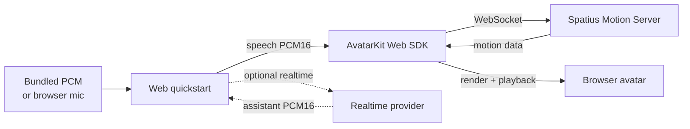

# Spatius Web Direct Mode Quickstart

[](https://www.npmjs.com/package/@spatius/avatarkit)

Minimal Web Direct Mode quickstart for `@spatius/avatarkit`. Start by sending bundled PCM audio to validate AvatarKit, then switch the UI to realtime conversation when you have a provider key.

## What this demo covers

| Audio source | Required config | What it proves |
| --- | --- | --- |
| Sample audio | Spatius App ID, Avatar ID, Session Token | Avatar load, Direct Mode Motion Server connection, PCM audio send, and local rendering. |
| Realtime conversation | Spatius config plus one realtime provider key | Browser mic -> realtime model -> assistant PCM audio -> AvatarKit lip sync. |

## Architecture



The realtime path is intentionally frontend-only for quickstart speed. In production, keep long-lived provider keys on your backend and mint short-lived browser tokens.

## Prerequisites

- Node.js 18+
- pnpm
- Spatius credentials:
  - `VITE_SPATIUS_APP_ID` — [Get from Studio](https://app.spatius.ai/apps)
  - `VITE_SPATIUS_AVATAR_ID` — [Pick from Avatar Library](https://app.spatius.ai/avatars/library)
  - `VITE_SPATIUS_SESSION_TOKEN` — Mint with the [Session Token API](https://docs.spatius.ai/api-reference/api-reference#obtain-a-session-token) or one of the [Direct Mode token server examples](../../../servers)

Realtime conversation is optional. This quickstart ships with OpenAI Realtime and Gemini Live WebSocket adapters:

| Provider | Env values | Docs |
| --- | --- | --- |
| OpenAI Realtime | `VITE_OPENAI_REALTIME_TOKEN`, `VITE_OPENAI_REALTIME_MODEL`, `VITE_OPENAI_REALTIME_VOICE` | https://developers.openai.com/api/docs/guides/realtime |
| Google Gemini Live API | `VITE_GEMINI_API_KEY`, `VITE_GEMINI_MODEL`, `VITE_GEMINI_API_VERSION` | https://ai.google.dev/gemini-api/docs/live-api |
| Azure OpenAI Realtime | Add your own adapter using the same `RealtimeClient` interface. | https://learn.microsoft.com/en-us/azure/ai-foundry/openai/how-to/realtime-audio-websockets |

## Setup

```bash
pnpm install
cp .env.example .env
```

Fill the Spatius values first. You can leave realtime provider values blank until you select **Realtime conversation** in the browser UI.

## Run

```bash
pnpm dev
```

Open `http://localhost:3000`.

1. Keep **Sample audio** selected.
2. Click **Connect avatar**.
3. Click **Send sample audio**.

The avatar should load, connect to Motion Server, and speak with lip sync.

## Optional realtime conversation

1. Set `VITE_REALTIME_PROVIDER` to `openai` or `gemini`.
2. Fill the matching provider key/model values in `.env`.
3. Restart `pnpm dev`.
4. Select **Realtime conversation** in the UI.
5. Click **Connect all**.
6. Hold **Hold to talk**, speak, then release.

Provider output audio is converted to the AvatarKit audio format before it is sent to `AvatarController.send()`.

## Troubleshooting

- **AvatarKit fails before sample audio plays**: refresh `VITE_SPATIUS_SESSION_TOKEN`. Direct Mode Session Tokens are short-lived and must match the App ID and region used by the client.
- **Sample audio works but realtime does not connect**: the AvatarKit path is valid. Check the selected provider key, model name, quota, and whether your provider account has realtime access.
- **Gemini closes with `1008: Your project has been denied access`**: the API key is valid enough to open the WebSocket, but the Google Cloud or AI Studio project does not have Gemini Live API access for that model. Use a project/key with Live API access or switch providers.
- **The browser asks for microphone permission**: allow microphone access for the local dev origin, then click **Hold to talk** again.

## How it works

1. `AvatarSDK.initialize()` runs in Direct Mode with `audioFormat.sampleRate = 16000`.
2. `AvatarSDK.setSessionToken()` authenticates the Motion Server WebSocket used by `AvatarController.start()`.
3. In sample mode, the bundled PCM16 mono 16 kHz file is sent directly to `avatarView.controller.send(audioData, true)`.
4. In realtime mode, microphone audio is converted to the provider input format.
5. The realtime provider returns assistant PCM16 audio.
6. Provider output audio is resampled to 16 kHz when needed, then streamed into `avatarView.controller.send(chunk, end)`.

## Project structure

```text
quickstart/
├── .env.example
├── index.html
├── package.json
├── public/
│   └── quickstart_voice.pcm
├── vite.config.ts
└── src/
    ├── App.vue
    ├── audio.ts
    ├── geminiLive.ts
    ├── openaiRealtime.ts
    ├── realtimeClient.ts
    ├── avatarkit-region.d.ts
    ├── main.ts
    └── style.css
```

## References

- [AvatarKit Direct Mode Guide](https://docs.spatius.ai/direct-mode/web)
- [Web SDK Quickstart](https://docs.spatius.ai/quickstarts/web-sdk)
