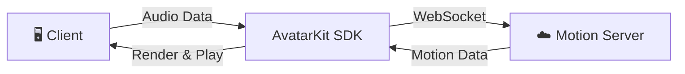

# Spatius Speech-to-Avatar Quickstart

[](https://www.npmjs.com/package/@spatius/avatarkit)

Minimal Web quickstart for Direct Mode. Connects an avatar and streams demo PCM audio with lip-sync — no agent backend required.

## Architecture



1. User clicks **Connect Avatar** — client establishes a WebSocket session with Motion Server
2. User clicks **Send Audio** — client fetches a fixed mono 16 kHz PCM file and streams it to the avatar
3. Motion Server returns motion data; the client renders lip-synced playback in real time

## Prerequisites

- Node.js 18+
- pnpm
- Spatius credentials:
  - `VITE_SPATIUS_APP_ID` — [Get from Studio](https://app.spatius.ai/apps)
  - `VITE_SPATIUS_AVATAR_ID` — [Pick from Avatar Library](https://app.spatius.ai/avatars/library)
  - `VITE_SPATIUS_SESSION_TOKEN` — [Generate in Studio](https://app.spatius.ai/apps) ([Guide](https://docs.spatius.ai/api-reference/api-reference#obtain-a-session-token))

## Setup

```bash
pnpm install
cp .env.example .env
```

Fill `.env` with your own values.

## Run

```bash
pnpm dev
```

Open `http://localhost:3000`, click **Connect Avatar**, then click **Send Audio**.

## Project Structure

```text
speech-to-avatar-quickstart/
├── .env.example
├── index.html
├── package.json
├── public/
│   └── quickstart_voice.pcm
├── vite.config.ts
└── src/
    ├── App.vue
    ├── main.ts
    └── style.css
```

## References

- [AvatarKit Direct Mode Guide](https://docs.spatius.ai/direct-mode/overview)
- [Get App ID and Session Token](https://app.spatius.ai/apps)
- [Test Avatars](https://app.spatius.ai/avatars/library)
