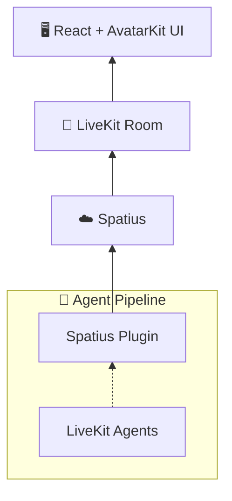

# Spatius Agent Quickstart

[](https://www.npmjs.com/package/@spatius/avatarkit)
[](https://www.npmjs.com/package/@spatius/avatarkit-rtc)
[](https://pypi.org/project/livekit-plugins-spatius/)

End-to-end voice agent quickstart with a React frontend (AvatarKit UI) and a LiveKit Agents backend powered by Gemini Live + Spatius avatar.

## Architecture



1. Frontend requests `/token` from backend
2. Backend returns LiveKit JWT and dispatches `voice-assistant`
3. Agent worker joins room and starts Gemini Live + Spatius avatar session
4. Frontend connects to LiveKit and renders avatar with `SpatiusAvatarProvider`

## Prerequisites

- Node.js 18+
- pnpm
- Python 3.10+
- uv
- [LiveKit Cloud credentials](https://cloud.livekit.io)
- [Google Gemini API key](https://aistudio.google.com/api-keys)
- [Spatius credentials](https://app.spatius.ai/apps)

## Setup

```bash
cp backend/.env.example backend/.env
cp frontend/.env.example frontend/.env
```

Fill both `.env` files with real values.

Install dependencies:

```bash
# Backend
cd backend
uv sync

# Frontend
cd ../frontend
pnpm install
```

## Run

Use 3 terminals:

```bash
# Terminal 1 — Token server
cd backend
uv run token_server.py
```

```bash
# Terminal 2 — Agent worker
cd backend
uv run agent.py dev
```

```bash
# Terminal 3 — Frontend
cd frontend
pnpm dev
```

Open `http://localhost:3000`, click **Connect**, then **Enable Mic**.

## Project Structure

```text
livekit-agent-quickstart/
├── backend/
│   ├── .env.example
│   ├── agent.py
│   ├── pyproject.toml
│   └── token_server.py
└── frontend/
    ├── .env.example
    ├── index.html
    ├── package.json
    └── src/
        ├── App.tsx
        ├── main.tsx
        ├── hooks/
        │   └── useSpatiusAvatar.ts
        ├── types/
        │   └── spatius-avatar.ts
        └── components/
            ├── spatius-avatar/
            └── ui/
```

## Version compatibility

`backend/pyproject.toml` pins `livekit-agents`, `livekit-plugins-google`, and `livekit-plugins-spatius` to matching versions. `livekit-plugins-spatius` tracks specific `livekit-agents` releases — keep these three pins moving together when you bump the plugin. Letting the resolver pull `livekit-agents` independently can drift past what the plugin supports.

## Troubleshooting

### Agent worker exits with `TypeError ... 'avatar_identity'`

The installed `livekit-agents` is newer than what your `livekit-plugins-spatius` supports. Restore the matching pin in `backend/pyproject.toml` and re-run `uv sync`.

### Gemini Live returns `APIError: 1008 ... denied access`

The Google project behind `GOOGLE_API_KEY` is not allowed to call the model in `E2E_GOOGLE_MODEL`. Verify in AI Studio's "Stream Realtime" tab with the same key. Then either switch to a project / key with Live access, switch `E2E_GOOGLE_MODEL` to a model your project can call (alternatives include `gemini-2.0-flash-live-001` and `gemini-live-2.5-flash-preview`), or replace `google.realtime.RealtimeModel` in `agent.py` with an OpenAI / Azure / xAI Realtime provider you already have access to.

## References

- [AvatarKit LiveKit Agents Guide](https://docs.spatius.ai/livekit-agents/overview)
- [LiveKit Agents Integration Quickstart](https://docs.spatius.ai/livekit-agents/quickstart)
- [Get App ID](https://app.spatius.ai/apps)
- [Test Avatars](https://app.spatius.ai/avatars/library)
