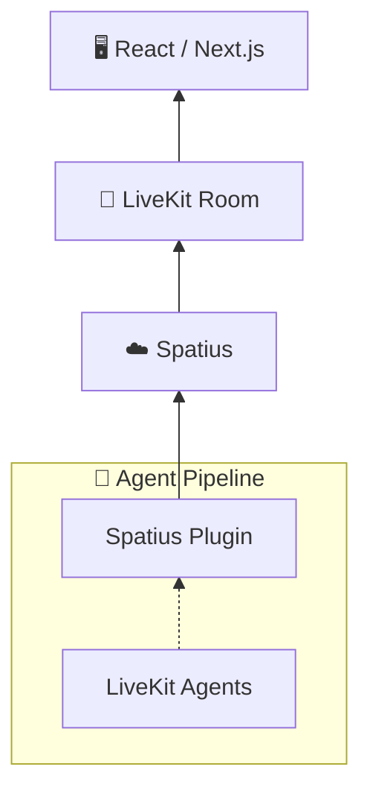

# LiveKit Agents Demos

[](https://www.npmjs.com/package/@spatius/avatarkit)
[](https://www.npmjs.com/package/@spatius/avatarkit-rtc)
[](https://pypi.org/project/livekit-plugins-spatius/)

Two backend strategies and two frontend implementations that share the same core UX:

- `backend/cascade` — VAD + STT + LLM + TTS pipeline (Silero + Deepgram + OpenAI-compatible + Cartesia)
- `backend/end-to-end` — Realtime speech-to-speech providers (OpenAI, Azure OpenAI, Google, AWS Nova Sonic, Ultravox, xAI)
- `frontend/vite-react-spa` — Vite React SPA
- `frontend/next` — Next.js (same UX as the Vite SPA)

## Architecture



Pick **one frontend** + **one backend** to form a working pair:

1. Frontend requests a LiveKit token from the backend token server
2. Backend returns JWT and dispatches a voice agent into the LiveKit room
3. Agent runs the selected pipeline (cascade or end-to-end) with Spatius avatar
4. Frontend connects to the room and renders the avatar's audio and motion stream

## Prerequisites

- Node.js 18+
- pnpm
- Python 3.10+
- uv
- [LiveKit Cloud credentials](https://cloud.livekit.io) (or self-hosted)
- [Spatius credentials](https://app.spatius.ai/apps)
- API keys for your chosen providers (see `.env.example` in each backend)

## Setup

### 1) Pick and set up ONE frontend

**Vite React SPA:**

```bash
cd frontend/vite-react-spa
cp .env.example .env
pnpm i
```

**Next.js:**

```bash
cd frontend/next
cp .env.example .env
pnpm i
```

Set avatar env vars in your chosen frontend's `.env`:

```bash
# Vite
VITE_SPATIUS_APP_ID=your_app_id
VITE_SPATIUS_AVATAR_ID=your_avatar_id

# Next.js
NEXT_PUBLIC_SPATIUS_APP_ID=your_app_id
NEXT_PUBLIC_SPATIUS_AVATAR_ID=your_avatar_id
```

### 2) Pick and set up ONE backend

**Cascade:**

```bash
cd backend/cascade
cp .env.example .env
uv sync
uv run agent.py download-files
```

**End-to-end:**

```bash
cd backend/end-to-end
cp .env.example .env
uv sync
uv run agent.py download-files
```

For end-to-end, choose a provider in `.env`:

```bash
E2E_PROVIDER=openai   # openai | azure-openai | google | aws | ultravox | xai
```

Then configure credentials for your selected provider (see `backend/end-to-end/.env.example`).

## Run

Run only the frontend/backend pair you selected:

```bash
# Terminal 1 — Token server
cd backend/cascade # or backend/end-to-end
uv run token_server.py
```

```bash
# Terminal 2 — Agent worker
cd backend/cascade # or backend/end-to-end
uv run agent.py dev
```

```bash
# Terminal 3 — Frontend
cd frontend/vite-react-spa # or frontend/next
pnpm dev
```

Open `http://localhost:3000`.

## Project Structure

```text
livekit-agents/
├── frontend/
│   ├── vite-react-spa/
│   └── next/
└── backend/
    ├── cascade/
    └── end-to-end/
```

## Deploy to LiveKit Cloud

Each backend includes a production Dockerfile. Deploy from inside your chosen backend folder:

```bash
cd backend/cascade # or backend/end-to-end

# Authenticate and select project
lk cloud auth

# Create deployment (first time)
lk agent create

# Deploy updates
lk agent deploy

# Set runtime secrets
lk agent update-secrets --secrets-file .env
```

Notes:

- LiveKit Cloud injects `LIVEKIT_URL`, `LIVEKIT_API_KEY`, and `LIVEKIT_API_SECRET` automatically.
- Keep provider keys and Spatius keys in secrets, not in image or source.
- For end-to-end, include `E2E_PROVIDER` in your deployment secrets.

## References

- [AvatarKit LiveKit Agents Guide](https://docs.spatius.ai/livekit-agents/overview)
- [LiveKit Agents](https://docs.livekit.io/agents/)
- [LiveKit Cloud Builds](https://docs.livekit.io/deploy/agents/builds/)
- [LiveKit Deployment Quickstart](https://docs.livekit.io/deploy/agents/quickstart/)
