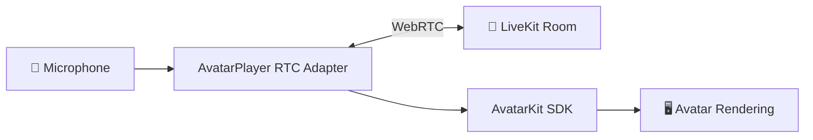

# RTC Adapter — LiveKit example

[](https://www.npmjs.com/package/@spatius/avatarkit)
[](https://www.npmjs.com/package/@spatius/avatarkit-rtc)

Minimal LiveKit example for `@spatius/avatarkit-rtc` (the [RTC Adapter](https://docs.spatius.ai/sdk-reference/web-sdk/rtc-adapter)) with `LiveKitProvider`. Validates the wiring end-to-end: token issuance, room connection, RTC Adapter + provider init, avatar load and render, and microphone publishing.

This demo has **no agent, no Server SDK, no Motion Server producer**, so it does not produce remote audio or motion. The avatar loads and renders in its idle state; remote audio playback and motion-driven lip-sync only happen when a remote publisher (e.g. a LiveKit Agents worker, or a Backend Mode service publishing into the same room) is in the room.

This is not the full Backend Mode + RTC transport voice-agent demo. The full pattern needs a service that, given a character / avatar identifier, both mints LiveKit tokens **and** publishes the avatar's audio + motion into the same room — that service is not packaged here. Use this example to validate adapter wiring; for an end-to-end voice-agent experience that does talk back, run [`livekit-agent-quickstart`](../livekit-agents-demo/livekit-agent-quickstart). Future provider examples (e.g. Agora) would sit as siblings under `platform-integrations/` (e.g. `platform-integrations/agora-room/`).

## Architecture



1. Backend issues a LiveKit token and creates the room
2. Frontend joins the room with `AvatarPlayer(LiveKitProvider, ...)` and establishes the RTC connection
3. Avatar loads and renders locally (idle). With no remote producer in this demo, the avatar stays idle — once a publisher joins the same room, the adapter plays the remote audio and renders motion-driven lip-sync.

## Prerequisites

- Node.js 18+
- pnpm
- Python 3.10+
- uv
- [LiveKit Cloud credentials](https://cloud.livekit.io) (or self-hosted)
- [Spatius credentials](https://app.spatius.ai/apps)

## Setup

```bash
# Backend
cd servers/python
cp .env.example .env
uv sync

# Frontend
cd ../../clients/web
cp .env.example .env
pnpm install
```

Fill both `.env` files with real values.

## Run

```bash
# Terminal 1 — Token server
cd servers/python
uv run token_server.py
```

```bash
# Terminal 2 — Frontend
cd clients/web
pnpm dev
```

Open `http://localhost:3003`.

## Project Structure

```text
platform-integrations/livekit-room-demo/
├── clients/
│   └── web/
│       ├── .env.example
│       ├── index.html
│       ├── package.json
│       ├── vite.config.ts
│       └── src/
│           ├── App.tsx
│           └── main.tsx
├── servers/
│   └── python/
│       ├── .env.example
│       ├── pyproject.toml
│       └── token_server.py
└── README.md
```

## References

- [RTC Adapter reference](https://docs.spatius.ai/sdk-reference/web-sdk/rtc-adapter)
- [Backend Mode with LiveKit](https://docs.spatius.ai/backend-mode/with-livekit)
- [LiveKit Agents client guide](https://docs.spatius.ai/livekit-agents/client)
- [Get App ID](https://app.spatius.ai/apps)
- [Test Avatars](https://app.spatius.ai/avatars/library)
- [Session Token Guide](https://docs.spatius.ai/api-reference/auth)
- [LiveKit Cloud](https://cloud.livekit.io/)
